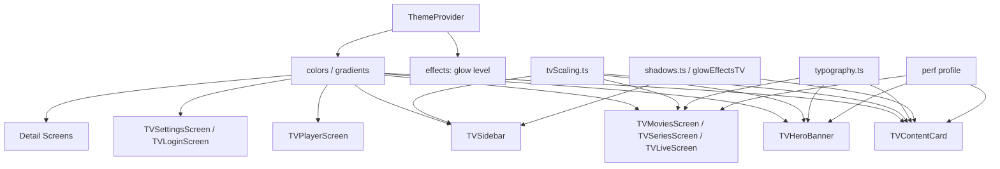
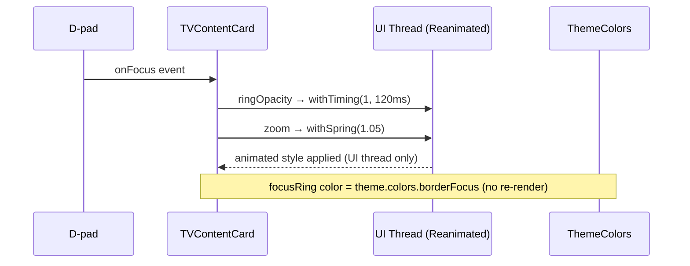
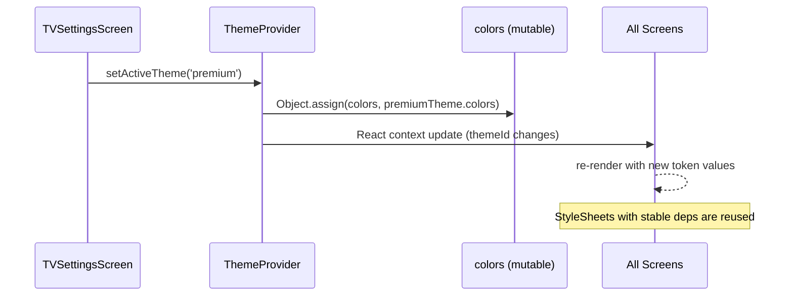

# Design Document: TV Styling Enhancement

## Overview

The Smartifly TV app already has a solid functional foundation and a multi-theme design system (`defaultTheme`, `premiumTheme`, `aetherTheme`). However, several screens and components use ad-hoc inline color literals, inconsistent spacing, and styling patterns that bypass the design system — resulting in a visual experience that feels unpolished and fragmented across screens.

This feature enhances the visual quality of the TV app to a fully professional, broadcast-grade standard while keeping performance as the primary constraint. Every styling change must be zero-cost at runtime: no new layout passes, no new animated values, no new `StyleSheet.create` calls per render, and no visual effects that require GPU compositing layers beyond what already exists. The performance bugfixes tracked in `tv-performance-issues` are treated as a hard dependency — styling changes must not regress any of those fixes.

The approach is **design-token-first**: all visual improvements flow from the existing theme system (`ThemeColors`, `typographyTV`, `spacingTV`, `borderRadiusTV`, `glowEffectsTV`). No new third-party libraries are introduced. The result is a consistent, premium look across all screens that runs at a stable 60 fps on HD, FHD, and 4K Android TV devices.

---

## Architecture



All screens consume tokens from the theme system. No screen hard-codes a color that exists in `ThemeColors`. The `perf` profile gates any effect that has a measurable GPU cost (glow, shadow elevation).

---

## Sequence Diagrams

### Focus Interaction Flow (Card)



### Theme Switch Flow



---

## Components and Interfaces

### Component 1: TVContentCard

**Purpose**: Displays a single content item (movie poster, live channel logo, series thumbnail) in a rail or grid. The most frequently rendered component in the app.

**Interface** (existing, no changes to props):
```typescript
interface TVContentCardProps {
  item: TVContentItem;
  onPress: (item: TVContentItem) => void;
  width?: number;
  height?: number;
  disableZoom?: boolean;
  onFocusItem?: (item: TVContentItem) => void;
  onBlurItem?: () => void;
  // ... focus chain props
}
```

**Styling Responsibilities**:
- Focus ring: uses `theme.colors.borderFocus` (white) for movies/series, `theme.colors.live` for live cards
- Focus glow: uses `glowEffectsTV` tokens, gated by `perf.enableFocusGlow`
- Badge: uses `theme.colors.live` for LIVE badge, `theme.colors.qualityHD` / `qualityUHD` for quality badges
- Rating: uses `theme.colors.warning` (`#F5C518`) for star color
- Card background: uses `theme.colors.cardBackground`
- Border radius: uses `borderRadiusTV.md` (8px) for movies, `borderRadiusTV.lg` (12px) for live

**Key Styling Rules**:
- `createStyles` is called once per unique `(liveColor, accentColor)` pair via `useMemo` with primitive string deps (already correct per bugfix spec)
- No inline style objects in JSX — all styles are in `StyleSheet.create`
- Shadow/glow values come from `glowEffectsTV` tokens, not hardcoded numbers

---

### Component 2: TVHeroBanner

**Purpose**: Full-width hero section at the top of the home screen. Displays backdrop image, title, metadata, and action buttons.

**Styling Responsibilities**:
- Title typography: `typographyTV.displaySmall` (40px scaled) with `textGlow.soft`
- Description: `typographyTV.bodyMedium` with `colors.textTertiary`
- Metadata row: `typographyTV.labelMedium`, `colors.textSecondary`
- IMDb badge: `colors.warning` background, `colors.textInverse` text
- Play button: `colors.primary` background → `colors.accent` on focus (Reanimated, UI thread)
- More Info button: `colors.glassMedium` background with `colors.borderMedium` border
- Add to List button: `colors.glass` background, `colors.border` border
- Gradient overlays: use `gradients.heroOverlay` stops (already defined in `colors.ts`)
- App logo: fixed asset, no styling change needed

---

### Component 3: TVSidebar

**Purpose**: Collapsible navigation sidebar. Expands on focus, collapses on blur.

**Styling Responsibilities**:
- Container: `colors.glassDark` background, `colors.borderMedium` border, `borderRadiusTV['3xl']`
- Rim light: `colors.border` (subtle white border inside container)
- Active indicator: `colors.primary` with `glowEffectsTV.primary` shadow
- Active halo: `colors.primary` at 25% opacity
- Focused item: `colors.glass` background, `colors.borderMedium` border
- Icon colors: `colors.iconActive` (focused/active), `colors.icon` (idle)
- Label: `typographyTV.labelMedium`, `colors.textSecondary` idle, `colors.textPrimary` focused
- Dividers: `colors.divider`

---

### Component 4: Category Screens (Movies / Series / Live)

**Purpose**: Two-panel layout — category list on left, content grid on right.

**Styling Responsibilities**:
- Panel title: `typographyTV.h2` with `colors.textPrimary`, title underline uses `colors.primary`
- Category item idle: `colors.glass` background, `colors.textMuted` text
- Category item selected: `colors.glassMedium` background, `colors.borderMedium` border, `colors.textPrimary` text
- Category item focused: `colors.primary` background, `colors.textOnPrimary` text
- Category count: `typographyTV.captionSmall`, `colors.textDisabled` idle, `colors.textOnPrimary` focused
- Grid header: `typographyTV.h3` for category name, `typographyTV.caption` + `colors.textMuted` for count
- Grid background: `colors.background`

---

### Component 5: TVPlayerScreen Controls

**Purpose**: HUD overlay during video playback. Shown on D-pad interaction, auto-hides after 5s.

**Styling Responsibilities**:
- HUD background: `colors.overlay` (semi-transparent dark)
- Progress bar track: `colors.borderMedium`
- Progress bar fill: `colors.primary`
- Progress bar thumb: `colors.accent` with `glowEffectsTV.soft`
- Control buttons: `colors.glass` background, `colors.iconActive` icon color on focus
- Time text: `typographyTV.labelSmall`, `colors.textSecondary`
- Title text: `typographyTV.h4`, `colors.textPrimary`
- Settings modal: `colors.backgroundElevated` background, `colors.borderMedium` border

---

### Component 6: TVLoginScreen

**Purpose**: Credential entry screen with server selector, username/password inputs, and submit button.

**Styling Responsibilities**:
- Background: `colors.background` with subtle `colors.backgroundSecondary` panel
- Input fields: `colors.backgroundInput` background, `colors.border` border idle, `colors.borderFocus` on focus
- Input text: `typographyTV.input`, `colors.textPrimary`
- Submit button: `colors.primary` background, `colors.textOnPrimary` text, `typographyTV.button`
- Error state: `colors.error` border, `colors.errorBackground` background tint
- Logo: fixed asset

---

### Component 7: TVSettingsScreen

**Purpose**: App settings — theme selector, quality, parental controls, account info.

**Styling Responsibilities**:
- Section headers: `typographyTV.h3`, `colors.textPrimary`, `colors.primary` accent underline
- Setting rows: `colors.backgroundSecondary` background, `colors.border` separator
- Focused row: `colors.backgroundTertiary` background, `colors.borderFocus` left accent bar
- Toggle active: `colors.primary`
- Toggle inactive: `colors.borderMedium`
- Theme preview cards: border `colors.borderFocus` when selected, `colors.border` otherwise

---

## Data Models

### StyleToken (conceptual — not a runtime type)

```typescript
// All styling decisions map to one of these token categories
type StyleToken =
  | { category: 'color';      key: keyof ThemeColors }
  | { category: 'typography'; key: keyof TypographyTV }
  | { category: 'spacing';    key: keyof SpacingTV }
  | { category: 'radius';     key: keyof BorderRadiusTV }
  | { category: 'shadow';     key: keyof GlowEffectsTV | keyof ElevationTV }
  | { category: 'scale';      fn: 'scale' | 'scaleFont' | 'scaleX' | 'scaleY' }
```

### PerfProfile (existing, from `@smartifly/shared/src/utils/perf`)

```typescript
interface PerfProfile {
  tier: 'low' | 'mid' | 'high';
  enableFocusGlow: boolean;       // gates shadow/elevation on focused cards
  enableHeroAnimations: boolean;  // gates entrance animations
  // ... other flags
}
```

Styling decisions that have GPU cost (shadows, elevation) are always gated by `perf.enableFocusGlow` or equivalent flags. This ensures low-tier devices (older Fire TV sticks, entry-level Android TV boxes) are not impacted.

---

## Algorithmic Pseudocode

### Main Styling Resolution Algorithm

```pascal
ALGORITHM resolveComponentStyle(component, theme, perf)
INPUT:
  component — component name (e.g. 'TVContentCard')
  theme     — active ThemeColors object
  perf      — PerfProfile
OUTPUT: StyleSheet object (stable reference)

BEGIN
  // Step 1: Extract primitive color tokens (prevents object reference instability)
  tokens ← extractPrimitiveTokens(theme, component)
  // tokens is a flat Record<string, string | number>

  // Step 2: Check memo cache (keyed by token values, not object reference)
  cacheKey ← buildCacheKey(tokens)
  IF styleCache[cacheKey] EXISTS THEN
    RETURN styleCache[cacheKey]
  END IF

  // Step 3: Build StyleSheet
  sheet ← StyleSheet.create(buildStyleDefs(tokens, perf))

  // Step 4: Store in cache
  styleCache[cacheKey] ← sheet

  RETURN sheet
END
```

**Preconditions:**
- `theme` is a valid `ThemeColors` object with all required keys
- `perf` is a valid `PerfProfile`

**Postconditions:**
- Returns the same `StyleSheet` object reference for identical token values
- `StyleSheet.create` is called at most once per unique token combination
- No object allocation on re-renders when theme has not changed

**Loop Invariants:** N/A (no loops in style resolution)

---

### Focus Glow Gate Algorithm

```pascal
ALGORITHM applyFocusEffect(isFocused, perf, theme, variant)
INPUT:
  isFocused — boolean (Reanimated shared value read on UI thread)
  perf      — PerfProfile
  theme     — ThemeColors
  variant   — 'live' | 'movie' | 'series'
OUTPUT: Animated style object (UI thread, no JS involvement)

BEGIN
  IF NOT isFocused THEN
    RETURN { shadowOpacity: 0, elevation: 0 }
  END IF

  IF NOT perf.enableFocusGlow THEN
    // Low-tier device: focus ring only, no shadow
    RETURN { shadowOpacity: 0, elevation: 0 }
  END IF

  // High/mid tier: apply glow from token
  glowToken ← SELECT CASE variant
    WHEN 'live'   → theme.liveGlow
    WHEN 'movie'  → theme.moviesGlow
    WHEN 'series' → theme.seriesGlow
    ELSE          → theme.neonGlow
  END SELECT

  RETURN {
    shadowColor:   glowToken.color,
    shadowOpacity: glowToken.opacity,   // 0.3–0.4
    shadowRadius:  glowToken.radius,    // scale(15–18)
    elevation:     14
  }
END
```

**Preconditions:**
- `isFocused` is read inside a `useAnimatedStyle` worklet (UI thread)
- `perf.enableFocusGlow` is a stable boolean (does not change during a render)

**Postconditions:**
- On low-tier devices: no shadow properties are set, preventing GPU overdraw
- On high/mid-tier devices: glow color matches content type
- No JS thread involvement during animation

**Loop Invariants:** N/A

---

### Token Extraction Algorithm (Stable Memo Deps)

```pascal
ALGORITHM extractPrimitiveTokens(theme, componentName)
INPUT:
  theme         — ThemeColors (may be new object reference)
  componentName — string
OUTPUT: flat Record<string, string> of only the tokens used by this component

BEGIN
  tokenMap ← COMPONENT_TOKEN_MAP[componentName]
  // e.g. TVContentCard → ['live', 'borderFocus', 'cardBackground', 'warning', ...]

  result ← {}
  FOR each tokenKey IN tokenMap DO
    result[tokenKey] ← theme[tokenKey]  // primitive string
  END FOR

  RETURN result
END
```

**Preconditions:**
- `COMPONENT_TOKEN_MAP` is a static constant defined at module level
- All keys in `tokenMap` exist in `ThemeColors`

**Postconditions:**
- `result` contains only primitive string values (no object references)
- `useMemo` deps array built from `result` values will only invalidate when a color value actually changes
- Prevents the Issue 1 bug pattern (style recreation on unstable theme reference)

**Loop Invariants:**
- All previously extracted tokens remain valid string values throughout iteration

---

## Key Functions with Formal Specifications

### Function 1: `createStyles(liveColor, accentColor)` — TVContentCard

```typescript
function createStyles(liveColor: string, accentColor: string): StyleSheet.NamedStyles<any>
```

**Preconditions:**
- `liveColor` is a non-empty CSS color string (hex, rgba, or named)
- `accentColor` is a non-empty CSS color string

**Postconditions:**
- Returns a frozen `StyleSheet` object
- Called via `useMemo([liveColor, accentColor])` — only re-runs when color values change
- The returned object is referentially stable across renders where colors are unchanged

**Loop Invariants:** N/A

---

### Function 2: `resolveQualityBadgeColor(quality, theme)` — TVContentCard

```typescript
function resolveQualityBadgeColor(quality: string, theme: ThemeColors): string
```

**Preconditions:**
- `quality` is a non-empty string (e.g. `'HD'`, `'4K'`, `'UHD'`)
- `theme` is a valid `ThemeColors` object

**Postconditions:**
- Returns `theme.qualityUHD` for `'4K'` or `'UHD'` (case-insensitive)
- Returns `theme.qualityHD` for `'HD'` or `'FHD'`
- Returns `theme.qualitySD` for `'SD'`
- Returns `theme.primary` as fallback
- No mutations to inputs

---

### Function 3: `buildCategoryItemStyle(isSelected, isFocused, theme)` — Category screens

```typescript
function buildCategoryItemStyle(
  isSelected: boolean,
  isFocused: boolean,
  theme: ThemeColors
): ViewStyle
```

**Preconditions:**
- `isSelected` and `isFocused` are booleans
- `theme` is a valid `ThemeColors` object

**Postconditions:**
- If `isFocused`: returns style with `backgroundColor: theme.primary`, `color: theme.textOnPrimary`
- If `isSelected && !isFocused`: returns style with `backgroundColor: theme.glassMedium`, `borderColor: theme.borderMedium`
- If neither: returns style with `backgroundColor: theme.glass`
- Returned style object is derived from `StyleSheet.create` (not inline)
- No mutations to inputs

**Loop Invariants:** N/A

---

### Function 4: `getGlowStyle(variant, perf, theme)` — TVContentCard

```typescript
function getGlowStyle(
  variant: ContentVariant,
  perf: PerfProfile,
  theme: ThemeColors
): ViewStyle
```

**Preconditions:**
- `variant` is one of `'live' | 'movie' | 'series'`
- `perf.enableFocusGlow` is a stable boolean
- `theme` contains valid glow color tokens

**Postconditions:**
- If `!perf.enableFocusGlow`: returns `{ shadowOpacity: 0, elevation: 0 }`
- Otherwise: returns shadow style using the appropriate `*Glow` token from `theme`
- Returned style is used inside `useAnimatedStyle` on the UI thread

---

## Example Usage

### Consuming theme tokens in a screen (TypeScript)

```typescript
// ✅ Correct: extract primitive tokens before useMemo
const TVMoviesScreen = () => {
  const { theme } = useTheme();

  // Extract primitives — stable memo deps
  const primaryColor   = theme.colors.primary;
  const textPrimary    = theme.colors.textPrimary;
  const textMuted      = theme.colors.textMuted;
  const glassColor     = theme.colors.glass;
  const glassMedium    = theme.colors.glassMedium;
  const borderMedium   = theme.colors.borderMedium;
  const textOnPrimary  = theme.colors.textOnPrimary;

  const styles = useMemo(
    () => createStyles(primaryColor, textPrimary, textMuted, glassColor, glassMedium, borderMedium, textOnPrimary),
    [primaryColor, textPrimary, textMuted, glassColor, glassMedium, borderMedium, textOnPrimary]
  );

  // ...
};
```

### Quality badge color resolution

```typescript
// ✅ Correct: use theme tokens, not hardcoded hex
const badgeColor = useMemo(() => {
  const q = (item.quality ?? '').toLowerCase();
  if (q === '4k' || q === 'uhd') return theme.colors.qualityUHD;
  if (q === 'hd' || q === 'fhd') return theme.colors.qualityHD;
  if (q === 'sd')                 return theme.colors.qualitySD;
  return theme.colors.primary;
}, [item.quality, theme.colors.qualityUHD, theme.colors.qualityHD, theme.colors.qualitySD, theme.colors.primary]);
```

### Perf-gated glow in useAnimatedStyle

```typescript
// ✅ Correct: read perf flag outside worklet, pass as dep
const enableGlow = perf.enableFocusGlow;
const glowColor  = isLive ? theme.colors.live : theme.colors.borderFocus;
const glowRadius = scale(18);

const cardAnimatedStyle = useAnimatedStyle(() => ({
  transform: [{ scale: disableZoom ? 1 : zoom.value }],
  shadowOpacity: enableGlow && focused.value === 1 ? 0.7 : 0,
  shadowRadius:  enableGlow && focused.value === 1 ? glowRadius : 0,
  shadowColor:   glowColor,
  elevation:     enableGlow && focused.value === 1 ? 14 : 0,
}), [disableZoom, enableGlow, glowColor, glowRadius]);
```

---

## Correctness Properties

The following properties must hold after all styling changes are applied.

**P1 — Token Coverage**: For every color value rendered in any component, there exists a corresponding key in `ThemeColors` that is the source of that value. No component renders a hardcoded hex color that has a semantic equivalent in the theme.

**P2 — Style Stability**: For any component C and any two consecutive renders R1, R2 where the theme has not changed, `StyleSheet` object returned by `createStyles(...)` in R2 is referentially equal to the one returned in R1.

**P3 — Perf Gate Integrity**: For any device where `perf.enableFocusGlow === false`, no component sets `shadowOpacity > 0` or `elevation > 0` on any focused element.

**P4 — Typography Consistency**: All text rendered in the app uses a variant from `typographyTV` (or `tvTypography` scaled values). No component uses a raw `fontSize` number that is not the result of `scaleFont(n)`.

**P5 — Focus Ring Visibility**: For any focused card, `ringOpacity.value` transitions to `1` within 120ms and `ringWidth.value` transitions to a non-zero value. This holds regardless of theme.

**P6 — Theme Reactivity**: When `setActiveTheme(id)` is called, all components that consume `useTheme()` re-render with the new color values within one React commit cycle.

**P7 — No Regression on Performance Bugfixes**: All 10 issues documented in `tv-performance-issues/bugfix.md` remain fixed after styling changes. Specifically:
- Issue 1: `createStyles` is not called when theme object reference changes but color values are unchanged
- Issue 2: Hero crossfade animations remain on the UI thread (Reanimated only)
- Issue 8: `focusTargets` state updates do not cause full home screen re-renders

---

## Error Handling

### Scenario 1: Theme token missing or undefined

**Condition**: A component accesses `theme.colors.someKey` and the value is `undefined` (e.g. after a theme migration that adds a new key not present in an older persisted theme).

**Response**: Each component that accesses a theme token provides a fallback literal as a default: `theme.colors.primary ?? '#E50914'`. The fallback is the `defaultTheme` value for that token.

**Recovery**: On next app launch, the theme is re-initialized from the registry, restoring all tokens.

---

### Scenario 2: `scaleFont` / `scale` returns 0 on unusual screen dimensions

**Condition**: `scaleFactor` computes to 0 or near-zero on a device with unusual reported dimensions.

**Response**: `scaleFont` and `scale` use `Math.round(size * scaleFactor)`. If `scaleFactor` is 0, the result is 0. Components that use `scaleFont` for `fontSize` would render invisible text.

**Response**: All `fontSize` values use `scaleMin(n, minPx)` where `minPx` is the minimum readable size (e.g. `scaleMin(18, 12)` ensures font is never below 12px).

**Recovery**: The `tvScaling.ts` `getScaleFactor()` already clamps to `Math.min(rawScale, 1.25)` but does not clamp the lower bound. A lower-bound clamp of `0.5` should be added.

---

### Scenario 3: `perf` profile unavailable

**Condition**: `usePerfProfile()` returns `null` or throws before the profile is loaded.

**Response**: All perf-gated styling decisions default to the `'mid'` tier behavior (glow enabled, animations enabled). This is the safe default — it may cause minor performance impact on very low-end devices but will not crash.

---

## Testing Strategy

### Unit Testing Approach

Test the pure styling utility functions in isolation:
- `resolveQualityBadgeColor(quality, theme)` — verify correct token returned for each quality string
- `buildCategoryItemStyle(isSelected, isFocused, theme)` — verify correct style variant for each state combination
- `extractPrimitiveTokens(theme, componentName)` — verify only primitive strings are returned, no object references

### Property-Based Testing Approach

**Property Test Library**: `fast-check`

**Property 1 — Style Stability (P2)**:
For any `ThemeColors` object `t` and any two calls to `createStyles` with the same primitive color values extracted from `t`, the returned `StyleSheet` objects are referentially equal (via memo cache).

```typescript
fc.assert(fc.property(
  fc.record({ liveColor: fc.hexaString(), accentColor: fc.hexaString() }),
  ({ liveColor, accentColor }) => {
    const s1 = createStylesMemoized(liveColor, accentColor);
    const s2 = createStylesMemoized(liveColor, accentColor);
    return s1 === s2;
  }
));
```

**Property 2 — Perf Gate (P3)**:
For any component render where `enableFocusGlow === false`, the resolved animated style has `shadowOpacity === 0` and `elevation === 0`.

**Property 3 — Token Coverage (P1)**:
For any theme in `themeRegistry`, every color token key in `ThemeColors` resolves to a non-empty string.

```typescript
fc.assert(fc.property(
  fc.constantFrom('default', 'premium', 'aether'),
  (themeId) => {
    const theme = themeRegistry[themeId];
    return Object.values(theme.colors).every(v => typeof v === 'string' && v.length > 0);
  }
));
```

### Integration Testing Approach

Manual smoke test on each target device tier after implementation:
- HD device (1280×720): verify no text is clipped, focus rings are visible, no layout overflow
- FHD device (1920×1080): verify baseline appearance matches design intent
- 4K device (3840×2160): verify scale factor produces correct proportions, no oversized elements

---

## Performance Considerations

Performance is the primary constraint. Every styling decision is evaluated against these rules:

1. **No new `StyleSheet.create` per render**: All `createStyles` calls are wrapped in `useMemo` with primitive string deps. The memo only invalidates when a color value actually changes (not when the theme object reference changes).

2. **No inline style objects in JSX**: Inline objects (`style={{ color: 'red' }}`) create new object references on every render, defeating React's reconciliation. All styles go through `StyleSheet.create`.

3. **Animations stay on the UI thread**: All focus animations (ring, zoom, glow) use Reanimated `useSharedValue` + `useAnimatedStyle`. No `Animated` API from React Native core is used for focus effects.

4. **Glow/shadow gated by perf profile**: Shadow and elevation properties trigger GPU compositing. They are only applied when `perf.enableFocusGlow === true` (mid/high tier devices).

5. **No new dependencies**: No new animation libraries, no new image processing, no new font loading. All visual improvements use existing primitives.

6. **`StyleSheet.flatten` avoided in hot paths**: `StyleSheet.flatten` is O(n) and should not be called in `renderItem` or `useAnimatedStyle`.

7. **Typography tokens are pre-scaled**: `typographyTV` values are computed once at module load time. Components reference them directly without calling `scaleFont` in render.

---

## Security Considerations

No security-sensitive changes. Styling is purely visual. The only indirect concern is:

- **Theme persistence**: If the active theme ID is persisted to AsyncStorage, it must be validated against `themeRegistry` keys on load to prevent injection of arbitrary theme objects. The existing `getThemeById` function already falls back to `defaultTheme` for unknown IDs.

---

## Dependencies

All existing — no new packages required:

| Dependency | Usage |
|---|---|
| `react-native-reanimated` | UI-thread focus animations (already used) |
| `@shopify/flash-list` | Recycled list rendering (already used) |
| `react-native-svg` | Hero gradient overlays (already used) |
| `react-native-fast-image` | Image loading with caching (already used) |
| Theme system (`theme/`) | All color, typography, spacing, shadow tokens |
| `tvScaling.ts` | Resolution-aware `scale()` / `scaleFont()` functions |
| `perf.ts` | Performance tier gating for visual effects |
